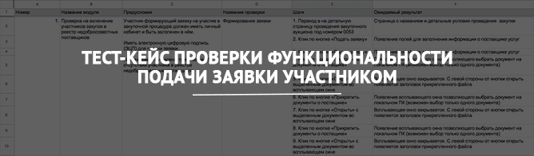

<h2 align="center">
<h2 align="center"><a  href="https://docs.google.com/spreadsheets/d/13YqJUbyrClCEVyBb2dBQXYFGWlSUFdmXsq9HoYCs758/edit?usp=sharing">Онлайн просмотр в Google Docs</a></h2>
<h2>Описание тест-кейса</h2>

<h4>Условия:</h4>

Согласно 44-ФЗ Заказчик вправе установить требование об отсутствии в реестре недобросовестных поставщиков (подрядчиков, исполнителей) информации об участнике закупки, в том числе информации об учредителях, о членах коллегиального исполнительного органа, лице, исполняющем функции единоличного исполнительного органа участника закупки - юридического лица.

<h4>Реализация:</h4>

<ul>
	<li>Информация о включении или исключении участников закупок из реестра недобросовестных поставщиков (подрядчиков, исполнителей) происходит путем интеграционного взаимодействия с внешней системой раз в сутки;</li>
	<li>Любой участник может подать заявку на участие в закупочной процедуре;</li>
	<li>В случае наличия условий для возврата заявки, поданной на участие в закупочной процедуре, система возвращает заявку участнику в момент её подачи, направив уведомление в личный кабинет участника, изменяя статус заявки с &quot;подана&quot; на &quot;возвращена&quot;.</li>
</ul>

<h4>Задача:</h4>

<ul>
	<li>Составить тест-кейсы на проверку функциональности подачи заявки участником в указанных условиях.</li>
</ul>

<h4>Дополнительно:</h4>

<ul>
	<li>Не особенно детализировать шаги в рамках тест-кейса.</li>
</ul>
